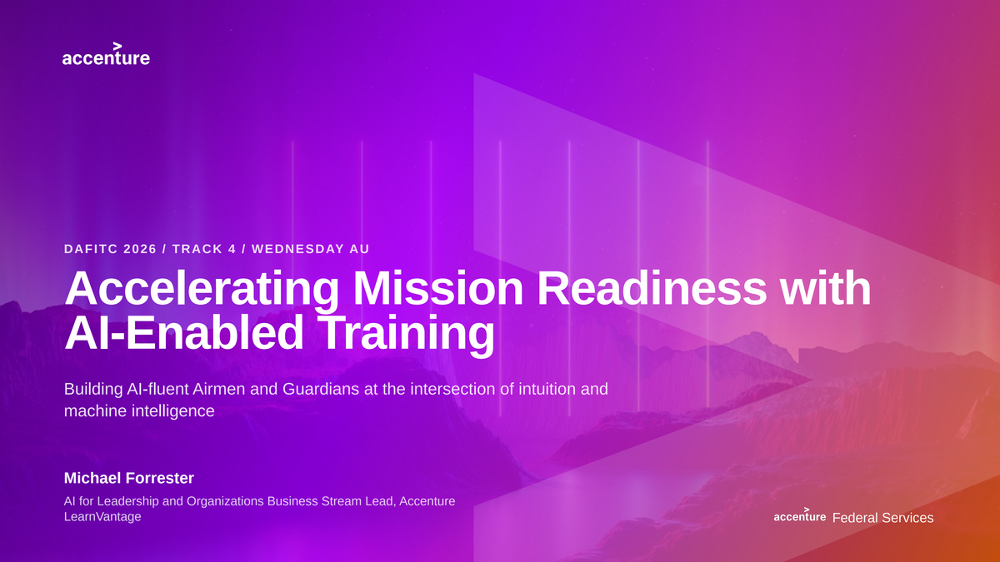
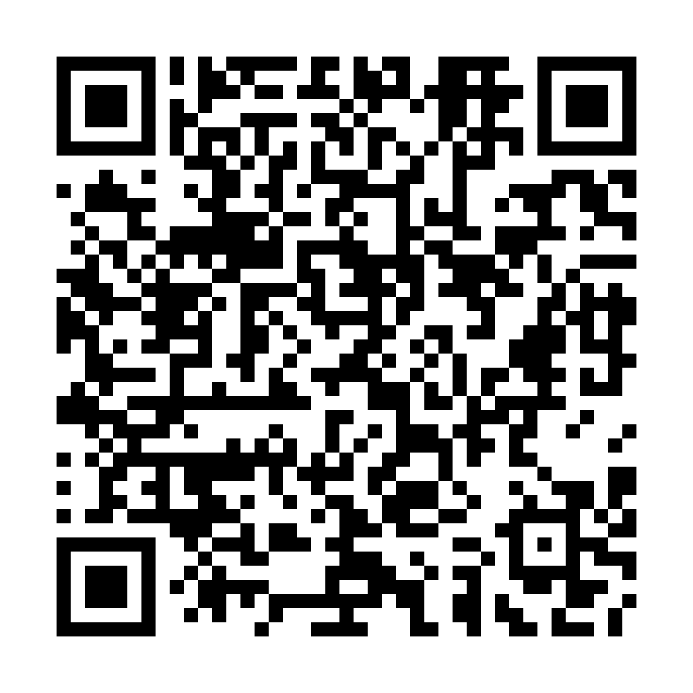

# DAFITC 2026 companion

Take-home material from **Accelerating Mission Readiness with AI-Enabled
Training**, Track 4, Wednesday 26 August 2026, Alabama C.

No login, no account, no purchase. Everything is sourced.

---

## The one idea

Your department has decided that demonstrated competency is the standard. No
directive tells you how to measure it.

It turns out you already know how. Every task in every Career Field Education
and Training Plan carries a proficiency code, graded by how much supervision the
work still needs. Level 3 is not "did it well". It is **needs only a spot check
of completed work**, and it is labelled *Competent*.

Your plan is not asking for a new kind of proof. It is asking why AI is the one
skill we were going to take on self-report.

---

## Start where your problem is

**Deciding whether to put AI on a workflow** → [The gate](instruments/the-gate.md)

**Explaining to an authorizing official how much independence a system should
get** → [Levels of autonomy](instruments/levels-of-autonomy.md)

**Proving a person actually got better** → [Assess, roadmap,
reassess](instruments/assess-roadmap-reassess.md)

**Working out whether a guardrail is real** → [Enforcement](instruments/enforcement.md)

**Sitting down with a vendor** → [Questions for a
vendor](templates/questions-for-a-vendor.md)

**Writing a capstone into a requirement** → [Capstone
specification](templates/capstone-specification.md)

**Explaining this upward** → [Brief your boss](templates/brief-your-boss.md)

**Checking slides you already have** → [What
changed](reference/what-changed.md)

---

## Everything, by kind

### The four instruments

The four things the session said you should leave with.

1. **[The gate](instruments/the-gate.md).** Seven questions that decide whether a
   workflow qualifies for AI at all. Scorable, one page.
2. **[Levels of autonomy](instruments/levels-of-autonomy.md).** Five capability
   levels against the human control posture each implies.
3. **[Assess, roadmap, reassess](instruments/assess-roadmap-reassess.md).**
   Competency as a measured delta instead of a claim.
4. **[Enforcement](instruments/enforcement.md).** Infrastructure enforcement
   versus a model's cooperation.

### Templates

Things you fill in, hand over, or forward.

- **[Questions for a vendor](templates/questions-for-a-vendor.md).** Fifteen
  questions, each with a wrong answer that should end the conversation.
- **[Capstone specification](templates/capstone-specification.md).** What a
  capstone looks like written down, so it becomes a requirement rather than a
  description.
- **[Brief your boss](templates/brief-your-boss.md).** One page. Forward it or
  read it out.

### Reference

- **[Air Force Proficiency Code Key](reference/proficiency-code-key.md).** The
  task performance and knowledge scales, verbatim, in one page.
- **[Official documents](reference/official-documents.md).** The Air Force and
  DoD sources that govern training, qualification, AI doctrine and risk.
- **[What changed](reference/what-changed.md).** Policy that has been rescinded
  or replaced, and claims in circulation that do not survive checking.
- **[Glossary](reference/glossary.md).** Every acronym the session used.
- **[Sources](reference/sources.md).** Every citation, with URLs.

---

## The slides

**[Download the deck](slides/AFS-DAFITC-2026-Accelerating-Mission-Readiness-v23.pptx)** · 31 slides · 2.5 MB · PowerPoint

**[See all 31 slides at a glance](assets/deck-contact-sheet.png)**

The deck as delivered, with the speaker notes left in. The notes carry the
sourcing and the reasoning behind each slide, which is usually the part people
want and rarely the part they get.

---

## The two learning paths

Both modes serve both tracks. The stage you are working in decides which you
need, not whether the person is an operator or a specialist.

**Breadth.** Adaptive digital training, self-paced role paths at scale.
Udacity for Government: https://www.udacity.com/government/overview

**Depth.** Hands-on instructor-led technical skilling, labs and capstones.
Ascendient Learning: https://www.ascendientlearning.com/it-training/topics/generative-ai

---

## How this is sourced

Every claim traces to a citation in [sources](reference/sources.md). Where a
source has a verified public URL it is linked. Where it does not, the citation is
written out in full and marked, rather than pointed at a confident-looking link
to the wrong page.

The Proficiency Code Key was read verbatim from two published CFETPs rather than
paraphrased.

Links are checked automatically on every change and once a week, because a
leave-behind outlives the talk. Some `.mil` and `.gov` hosts block automated
requests; those URLs are correct and open normally in a browser.

---

## Further reading

**[Agentic Covenants](https://github.com/peopleforrester/agentic-covenants)**,
for implementing infrastructure-enforced agent governance. Six matrices mapped to
NIST CSF 2.0, with working policies and runbooks rather than principles.

**[The AI Adoption Maturity
Model](https://www.sei.cmu.edu/documents/6534/The_AI_Adoption_Maturity_Model.pdf)**,
Carnegie Mellon SEI with Accenture, for assessing an organisation rather than a
person.

---

## Scan or type

**github.com/peopleforrester/dafitc-2026-companion**

The QR image is committed here, so the code on the slide and the destination
cannot drift apart.

---

Found a dead link or a wrong citation? [Open an
issue](https://github.com/peopleforrester/dafitc-2026-companion/issues/new).
See [CONTRIBUTING](CONTRIBUTING.md). Licensed [CC BY 4.0](LICENSE).

Michael Forrester, Accenture LearnVantage via Accenture Federal Services.
michael.r.forrester@accenture.com
